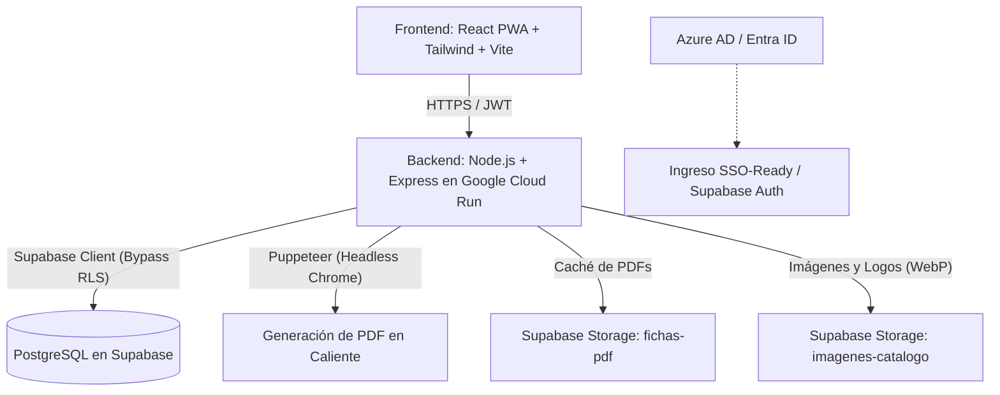

# Fichas Técnicas Easy Cencosud (Góndolas & Salón de Ventas)

Aplicación web móvil corporativa (PWA) diseñada para optimizar los procesos de búsqueda, validación, edición y generación en PDF de fichas técnicas de productos y cartelas de góndola (flejes) para las tiendas **Easy** del grupo **Cencosud**.

---

## 🏗️ Arquitectura de la Solución

El sistema sigue una arquitectura desacoplada moderna y 100% serverless, ideal para optimizar costos de infraestructura y escalar de forma transparente ante picos de demanda en los locales comerciales.



### Componentes de la Arquitectura
1.  **Frontend (React Client - Firebase Hosting):**
    *   Compilado como una **PWA (Progressive Web App)** con soporte offline mediante Service Workers.
    *   Utiliza la API `HTML5 IndexedDB` local en el celular para almacenar las búsquedas exitosas, mantener la cola de impresión temporal y permitir la visualización offline de fichas en zonas ciegas de Wi-Fi del salón.
2.  **Backend (API Server - Google Cloud Run):**
    *   Una API REST desarrollada en Node.js y Express empaquetada en un contenedor Docker.
    *   Realiza procesamiento de compresión en caliente mediante Canvas a formato WebP para fotos de productos y marcas subidas por operadores autorizados.
    *   Utiliza Puppeteer (Headless Chrome) para la renderización matemática exacta de los PDFs a partir de plantillas HTML y CSS diseñadas a escala real de impresión (`A4`, `90x74mm` y `80x40mm`), garantizando alineación de estilos entre páginas en impresiones masivas.
3.  **Repositorio de Medios y CDN (Supabase Storage):**
    *   `fichas-pdf`: Implementa una estrategia *Cache-Aside* para evitar la saturación de CPU que provoca levantar múltiples procesos Chrome. Las descargas de PDFs pre-generados se sirven de manera directa en `<50ms`.
    *   `imagenes-catalogo`: Contenedor público para almacenar fotos de productos (indexadas por SKU) y logotipos de marcas comerciales (indexadas por slug) cargadas de forma dinámica.
4.  **Capa de Datos y Autenticación (Supabase PostgreSQL):**
    *   Almacena las especificaciones de SAP, las fichas aprobadas locales, la tabla dinámica de `marcas` y los mapeos de códigos de barra (EAN).
    *   Autenticación integrada via JWT para control de accesos.

---

## 🌟 Características Principales

*   **Buscador Multimodal:** Permite escanear códigos de barra directamente con la cámara del celular del operador (librería `html5-qrcode`) o escribir manualmente el SKU/EAN.
*   **Enriquecimiento con Gemini AI:** Si el producto consultado existe en SAP pero no tiene ficha técnica creada, el backend invoca a Gemini Pro en tiempo real para estructurar las especificaciones técnicas del texto del producto de SAP de manera estructurada en JSON.
*   **Gestión Dinámica de Logos e Imágenes:** Los administradores y coordinadores pueden arrastrar y cargar fotos de productos o marcas directamente desde la pantalla de edición del producto. Las imágenes se procesan localmente vía Canvas en WebP para ahorrar ancho de banda y almacenamiento antes de ser subidas a Supabase Storage.
*   **Auditoría y Alertas de Calidad (Completitud):** Evaluador inteligente en tiempo real que mide la completitud de la ficha (SKU 15%, EAN 15%, Marca 10%, Logo 5%, Foto 20%, Descripción 15%, Especificaciones 20%) y alerta al operador sobre inconsistencias como la falta de código de barras o logotipo corporativo no registrado.
*   **Cola de Impresión Avanzada (Batch Printing):** Permite encolar múltiples fichas en IndexedDB local, previsualizarlas en lote, vaciar la cola con feedback háptico suave (`vibrate`) y generar un único PDF de impresión A4 continuo con estilos unificados y paginación homogénea.
*   **Diseño e Impresión Centrada (Anti-Recortes):** Todas las plantillas se generan en tamaño A4 con guías punteadas de corte y márgenes seguros de `15mm` para evitar que los rodillos de las impresoras físicas recorten logotipos o textos.
*   **Control de Roles de 3 Niveles (RBAC):**
    *   *Administrador:* Acceso a carga masiva SAP y configuraciones generales de marcas y catálogos.
    *   *Coordinador de Cartelería:* Permisos para editar atributos, cargar fotos y marcas, y aprobar fichas técnicas locales.
    *   *Operador de Pasillo:* Búsqueda, visualización y envío a impresión rápida (sin privilegios de edición).
*   **Carga Asíncrona SAP:** Ingestión de planillas Excel de SAP procesadas en segundo plano con una barra de progreso dinámico en tiempo real para evitar caídas por timeouts.

---

## 🛠️ Tecnologías y Dependencias

### Frontend
*   **Vite + React (JS):** Entorno de ejecución rápido y empaquetado.
*   **Tailwind CSS:** Diseño UI móvil responsivo siguiendo el branding corporativo de Easy.
*   **Vite-Plugin-PWA:** Generación de Service Workers para soporte offline.
*   **Lucide-React:** Set de iconos vectoriales.
*   **HTML5 QR Code:** Escaneo de códigos de barra desde el navegador móvil.

### Backend
*   **Node.js + Express:** API Servidora robusta y ligera.
*   **Puppeteer:** Compilación exacta de HTML a formato PDF PDF/A-1a.
*   **Supabase JS Client:** Comunicación con la base de datos PostgreSQL, Supabase Auth y Storage.
*   **XLSX (SheetJS):** Lectura veloz de reportes de logística SAP en formato Excel.
*   **Helmet & Express Rate Limit:** Protección contra inundaciones de red, inyecciones de código y fuerza bruta.

---

## 📁 Estructura del Repositorio

```text
├── backend/
│   ├── lib/
│   │   ├── easyFetcher.js      # Consultas y extracción de imágenes del sitio público
│   │   ├── geminiExtractor.js  # Integración con la API de Google Gemini Pro
│   │   ├── pdfGenerator.js     # Motor de renderizado A4/Flejes con Puppeteer
│   │   ├── supabase.js         # Inicialización de clientes Supabase (con y sin RLS)
│   │   └── taskManager.js      # Gestor de tareas asíncronas en memoria
│   ├── middlewares/
│   │   └── authMiddleware.js   # Protección de rutas por JWT y roles (Admin/Operador)
│   ├── routes/
│   │   ├── catalogos.js        # Ingesta SAP, Login de contingencia y consulta de tareas
│   │   ├── impresion.js        # Endpoints de generación y CDN caché de PDFs
│   │   └── productos.js        # Búsqueda, borrador Gemini y aprobación de fichas
│   ├── templates/
│   │   ├── template_a4.html    # Plantilla HTML de ficha técnica en A4
│   │   ├── template_fleje_3.html # Plantilla de cartela de góndola de 90x74mm
│   │   └── template_fleje_2.html # Plantilla de cartela de góndola de 80x40mm
│   ├── index.js                # Punto de entrada de la API Express
│   └── package.json
└── mobile/
    ├── public/
    │   └── easy-logo.png       # Recursos estáticos
    ├── src/
    │   ├── components/
    │   │   ├── AdminPanel.jsx  # Panel administrativo para carga SAP y progreso asíncrono
    │   │   ├── FichaEditor.jsx # Editor de atributos, selector de plantilla y botones PDF
    │   │   ├── Scanner.jsx     # Escáner móvil integrado para cámara
    │   │   └── WelcomeLogin.jsx # Login corporativo / SSO-Ready
    │   ├── lib/
    │   │   └── indexedDb.js    # Capa de base de datos offline local del navegador
    │   ├── App.jsx             # Orquestador del flujo principal y estado offline
    │   └── main.jsx
    ├── vite.config.js          # Configuración de Vite, proxy local y PWA
    └── package.json
```
